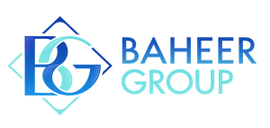

<!-- Animated Header - Smaller -->

  

<!-- Compact Title -->
<h3 align="center">
  
  Asalamualaikum, I'm AhmadUllah Mukhlis
  
</h3>

<!-- Compact Badges Row -->

  
  
  
  

<!-- Compact About Section -->

   
  <table>
    <tr>
      <td width="200">
        
      </td>
      <td align="left" width="500">
        <strong>🚀 Full-Stack Developer</strong> 
        • 🔭 Working on enterprise web applications 
        • 🌱 Learning system architecture & cloud technologies 
        • 💬 Ask me about full-stack development 
        • ⚡ Fun: I turn complex problems into simple solutions
      </td>
    </tr>
  </table>
  
  <!-- Compact Contact -->
  

    
    
    
  

 

<!-- Companies - Compact Grid -->

  <h4>🏢 Work Experience</h4>
  <table>
    <tr>
      <td align="center" width="160"> <small><b>Baheer Group</b> Full Stack Dev</small></td>
      <td align="center" width="160"> <small><b>Da Afghanistan Bank</b> Senior Developer</small></td>
      <td align="center" width="160"> <small><b>APS Afghanistan</b> Lead Developer</small></td>
    </tr>
  </table>

 

<!-- Skills - Compact Icon Grid -->

  <h4>🛠️ Tech Stack</h4>
  
  <!-- Frontend -->
  

    
    
    
    
    
    
    
    
    
    
    
  

  <!-- Backend -->
  

    
    
    
    
    
    
    
  

  <!-- Databases -->
  

    
    
    
    
  

  <!-- Tools -->
  

    
    
    
    
    
    
  

 

<!-- GitHub Analytics - FIXED VERSION -->

  <h4>📊 GitHub Analytics</h4>
  
  <!-- Stats Row 1 - Fixed working links -->
  

    
  
  

  
  <!-- Stats Row 2 - Fixed working links -->
  

    
    
  

  <!-- Profile Summary Card -->
  

    
  

  <!-- GitHub Trophies -->
  

    
  

 

<!-- Activity Graph - FIXED -->

  <h4>⚡ Contribution Graph</h4>
  

 

<!-- Language Distribution - ADDED -->

  <h4>📈 Language Distribution</h4>
  

    
    
    
  

 

<!-- Snake Animation -->

  <h4>🐍 Contribution Snake</h4>
  <picture>
    <source media="(prefers-color-scheme: dark)" srcset="https://github.com/ahmadullahmukhlis/ahmadullahmukhlis/blob/output/github-contribution-grid-snake-dark.svg" />
    <source media="(prefers-color-scheme: light)" srcset="https://github.com/ahmadullahmukhlis/ahmadullahmukhlis/blob/output/github-contribution-grid-snake.svg" />
    
  </picture>

 

<!-- Recent Activity - Compact -->

  <h4>🔄 Recent GitHub Activity</h4>
  <table>
    <tr>
      <td>
        <!--RECENT_ACTIVITY:start-->
        1. 🎉 Created new repository 
        2. 🔱 Pushed commits to main 
        3. ⭐ Starred interesting projects 
        4. 🔀 Merged pull requests 
        5. 🎉 Created another project
        <!--RECENT_ACTIVITY:end-->
         
        <small>📅 Last updated: February 2026</small>
      </td>
    </tr>
  </table>

 

<!-- Dev Quote -->

  <h4>💭 Random Dev Quote</h4>
  

 

<!-- Footer -->

  
  
  

     
    <b>⭐️ From <a href="https://github.com/ahmadullahmukhlis">AhmadUllah Mukhlis</a></b>
    
  

  
  

    
  

<!-- Simple CSS -->

